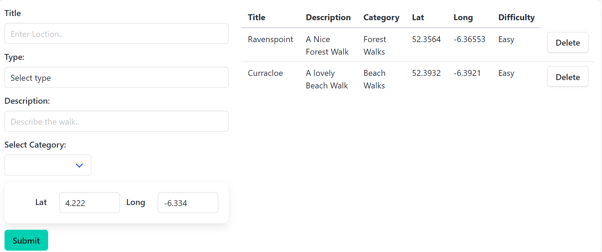

# Placemark Svelte Front End 
- Student Name: Eoin Geoghegan
- Student ID: 20036009

## Where to go?

- Backend: poi-974z.onrender.com

- Frontend: poifront.netlify.app

- Quick Login: Email: homer@mail.com Password: a

# Github

- [Back End Repository](https://github.com/eoingeoghegan/POI)  
- [Front End Repository](https://github.com/eoingeoghegan/POI-Svelte)

# Project:
- "A point of interest (POI) is a location for which information is available. A POI can be as simple as a set of coordinates, a name, and a unique identifier, or more complex, such as a three-dimensional model of a building with names in multiple languages, information about opening and closing hours, and a civic address. POI data has many applications, including augmented reality browsers, location-based social networking games, geocaching, mapping, and navigation systems." Source.

- This application allows users to register, sign in, and manage points of interest (POI) in various categories (walks). After logging in, users can create and view their walking categories and add placemarkers. Images can be uploaded on the back end and be viewed on frontend.

# Technologies Used
- Svelte
- SvelteKit
- Apache Echarts
- Leaflet Maps
- Typescript
- MongoDB
- Axios
- Cloudinary

# Usage
- Sign Up / Log In: Create an account or log into an existing account using your email and password or use quick login details above.
- User Dashboard: After login, you’ll be directed to your personal dashboard where you can add placemrkers by difficulty and category. The user will see the displayed information after submitting a placemarker and the data can be seen on the Echarts and Map.

# API Documentation
Here are the available API endpoints for interacting with the user data using baseUrl:
- This app uses Axios to  make requests to backend API to localhost:4000.

User Endpoints
- POST	/api/users	Register
- POST	/api/users/authenticate	Login and receive token

Category Endpoints
- GET	/api/categories	Get all categories	
- POST	/api/categories/:id/uploadImage	Upload image for a category	

Placemarker Endpoints
- POST	/api/categories/:categoryId/placemarkers	Create a placemarker in a category
- GET	/api/placemarkers	Get all placemarkers	
- DELETE	/api/placemarkers/:placemarkerId	Delete a specific placemarker	

# Known Issues
Issue 1: After adding a placemarker to the list when the user presses the delete button, the page needs to be refefreshed for the placemarker to be deleted.

Issue 2: When submitting a placemarker the page needs to be reloaded to see the data on the Charts

Issue3: When signing up Frontend, after pressing submit the user does get signed up the but info remains in the boxes.

Issue4: If there are multiple users and each add a category title. These titles all show in the front end when logged in instead of just logged in users category title.

# ScreenShots

 

